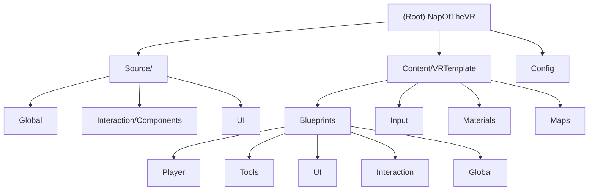

# NapOfTheVR - Unreal Engine 5.6 VR Project

## Project Vision
NapOfTheVR is an Unreal Engine VR project focused on immersive VR experiences with advanced interaction systems. Built on UE 5.6 with OpenXR support for cross-platform VR compatibility, the project features spline-based construction tools, intuitive menu systems, and sophisticated grab mechanics for natural VR interactions.

## Architecture Overview
This project follows a hybrid C++/Blueprint architecture pattern optimized for VR development:

- **C++ Core Layer**: Core gameplay systems, components, and subsystems
- **Blueprint Layer**: VR-specific interactions, UI widgets, and tools
- **OpenXR Integration**: Cross-platform VR support (Quest 2/Pro/3, PC VR)
- **Modular Design**: Separate modules for interaction, UI, tools, and global systems

## Module Structure Diagram

## Module Index

| Module | Path | Language | Responsibility |
|--------|------|----------|---------------|
| Global C++ | `Source/NapOfTheVR/Global/` | C++ | Core game systems, subsystems, and global state management |
| Interaction C++ | `Source/NapOfTheVR/Interaction/` | C++ | VR grab components and interaction systems |
| UI C++ | `Source/NapOfTheVR/UI/` | C++ | Base C++ widget classes for VR menus |
| Player Blueprints | `Content/VRTemplate/Blueprints/Player/` | Blueprint | VR pawn, interfaces, and player systems |
| Tools Blueprints | `Content/VRTemplate/Blueprints/Tools/` | Blueprint | Construction tools like spline wall builder |
| UI Blueprints | `Content/VRTemplate/Blueprints/UI/` | Blueprint | VR menu widgets and interface elements |
| Interaction Blueprints | `Content/VRTemplate/Blueprints/Interaction/` | Blueprint | Grabbable objects and interaction logic |
| Global Blueprints | `Content/VRTemplate/Blueprints/Global/` | Blueprint | Game mode, game instance, and global logic |
| Input System | `Content/VRTemplate/Input/` | Data Assets | VR input mappings and actions |
| Materials | `Content/VRTemplate/Materials/` | Materials | VR-optimized materials and shaders |
| Maps | `Content/VRTemplate/Maps/` | Levels | VR environments and template maps |
| Configuration | `Config/` | INI Files | Engine settings and platform configurations |

## Running and Development

### Prerequisites
- Unreal Engine 5.6
- Visual Studio 2022 (for C++ development)
- OpenXR-compatible VR headset
- Windows 10/11 for development

### Setup Instructions
1. Clone the repository
2. Right-click `NapOfTheVR.uproject` and select "Generate Visual Studio project files"
3. Open `NapOfTheVR.sln` in Visual Studio
4. Build the project (Development Editor configuration)
5. Launch through Visual Studio or directly open the `.uproject` file

### VR Configuration
- Supports Quest 2, Quest Pro, Quest 3 via Meta Quest Link/Air Link
- PC VR headsets through OpenXR
- Hand tracking and eye tracking enabled where supported

## Testing Strategy

### Blueprint Testing
- Manual testing in VR editor preview
- PIE (Play in Editor) testing for rapid iteration
- Device testing on target VR platforms

### C++ Testing
- Unit tests for core components (planned)
- Integration tests for subsystems
- VR-specific interaction testing

## Coding Standards

### C++ Guidelines
- Use Unreal Engine coding conventions
- Prefix classes with `Note` (e.g., `UNoteGameInstance`)
- Comprehensive header comments with file descriptions
- UPROPERTY for Blueprint exposure where needed

### Blueprint Guidelines
- Clear node organization and commenting
- Consistent variable naming conventions
- Proper use of interfaces for VR interactions
- Performance-conscious Blueprint design for VR

## AI Usage Guidelines

### Recommended AI Assistance
- Code refactoring and optimization suggestions
- Blueprint logic improvements
- VR interaction pattern recommendations
- Performance analysis for VR applications

### Areas Requiring Human Oversight
- VR comfort and motion sickness considerations
- Platform-specific VR implementation details
- Complex spatial interaction logic
- Performance-critical VR rendering code

## Changelog

### 2025-09-06 (Initial Documentation)
- Created comprehensive project documentation structure
- Documented existing C++ and Blueprint architecture
- Established coding standards for VR development
- Set up modular documentation system with navigation

### Recent Development (from Git History)
- Enhanced BP_SplineWall with motion controller integration
- Improved spline mesh fitting and robustness
- Integrated WBP_Menu with NoteMenuUserWidget C++ base class
- Refactored menu system architecture for better C++/Blueprint integration